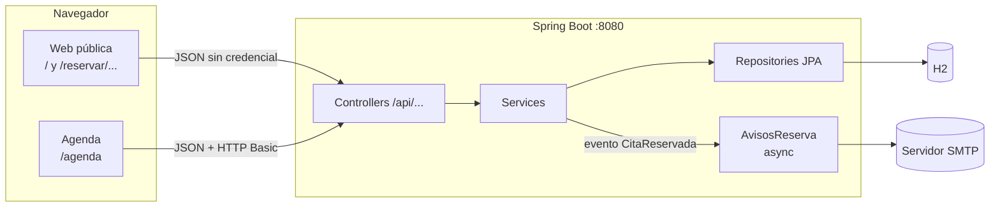

# Arquitectura

## Tecnologías

| Parte | Tecnología |
|---|---|
| Backend | Java 25, Spring Boot 4.1 (Web MVC, Data JPA, Security, Mail) |
| Base de datos | H2 (ver [limitaciones](limitaciones.md#base-de-datos-en-memoria)) |
| Frontend | React 19, React Router 8, Vite 8, Tailwind CSS 4, componentes shadcn/ui (Radix) |
| Pruebas | JUnit 5 + MockMvc (backend), Vitest + Testing Library + jsdom (frontend) |
| Calidad | oxlint en el frontend |

## Visión general



- El frontend siempre llama a rutas relativas `/api/...`. En desarrollo, el proxy de Vite (`frontend/vite.config.js`)
  las manda a `http://localhost:8080`, así que no hace falta CORS.
- La web pública no usa credencial. La agenda manda la cabecera `Authorization: Basic ...` en cada petición
  (sin sesión ni cookie).

## Backend (`src/main/java/disnaking/Hueco`)

Arquitectura en capas clásica:

| Paquete | Qué contiene |
|---|---|
| `controller` | Endpoints REST. Traducen HTTP a llamadas de servicio y excepciones a códigos de estado |
| `service` | Lógica de negocio: cálculo de huecos, reservas, agenda, emails |
| `repository` | Interfaces Spring Data JPA |
| `model` | Entidades JPA y enums |
| `DTO` | Lo que entra y sale por la API. Nunca se exponen datos personales donde no toca |
| `config` | Seguridad, reloj, `@ConfigurationProperties`, `@EnableAsync` |
| `Exception` | Excepciones de dominio que los controllers convierten en 400 / 404 / 409 / 429 |

### Piezas principales

| Clase | Responsabilidad |
|---|---|
| `CalculadoraHuecos` | Calcula las horas libres de cada día. **No toca la base de datos**: recibe horario, cierres y citas. Así se prueba con reloj fijo y se reutiliza al reservar |
| `HuecoService` | Carga lo que necesita la calculadora (negocio, servicios, citas del plazo) |
| `ReservaService` | Reserva como invitado: valida, aplica límites, bloquea, vuelve a comprobar la hora y guarda. También resumen, cancelación y `.ics` |
| `LimiteReservasPorIp` | Ventana deslizante de 1 hora por IP, en memoria |
| `Telefonos` | Normaliza teléfonos españoles a `+34XXXXXXXXX` |
| `AgendaService` | Semana de citas para el comercio |
| `AvisosReserva` / `CorreosReserva` | Envío asíncrono de emails tras confirmar la transacción / texto de los emails |
| `CalendarioIcs` | Genera el evento iCalendar (RFC 5545) de una cita |
| `NegocioService` | Datos públicos del comercio y estado "abierto / cerrado" de hoy |

### El reloj

`ClockConfig` publica un `Clock` en la zona `hueco.zona-horaria` (por defecto `Europe/Madrid`). Todo lo que depende
de "ahora" (horas libres, antelación, plazo de cancelación, "hoy" de la agenda) usa ese reloj, **no** la zona del servidor
ni la del navegador. En los tests se sustituye por un reloj fijo.

## Frontend (`frontend/src`)

| Carpeta | Qué contiene |
|---|---|
| `pages/` | Una página por ruta. `pages/reservar/` son los tres pasos más la confirmación |
| `components/` | Piezas de interfaz. `components/ui/` son los componentes de shadcn |
| `api/` | `client.js` (fetch JSON), `useFetch.js` (hooks de datos), `agenda.js` (credencial y agenda) |
| `lib/` | Lógica pura y testeada: selección de servicios, validación de datos, formato de fechas y precios |
| `texts/es.js` | **Todos** los textos de la interfaz |
| `business.config.js` | Datos del comercio fijados al compilar: nombre, teléfono de respaldo, logo y fotos |

### Rutas

| Ruta | Página | Notas |
|---|---|---|
| `/` | `HomePage` | Portada: eslogan, carta de servicios, horario, opiniones, contacto |
| `/reservar` | `ServiciosPage` | Paso 1 |
| `/reservar/horario` | `HorarioPage` | Paso 2 |
| `/reservar/datos` | `DatosPage` | Paso 3 |
| `/reservar/confirmada/:token` | `ConfirmadaPage` | Resumen, `.ics`, cómo llegar, cancelar |
| `/privacidad` | `PrivacidadPage` | Texto de privacidad |
| `/agenda` | `AgendaPage` | Fuera del `Layout`: sin la navegación de la web pública |

### Dónde vive el estado

El estado de la reserva vive en la **URL**, no en memoria:

```
/reservar?servicios=2,5
/reservar/horario?servicios=2,5&fecha=2026-10-02&hora=10:15
/reservar/datos?servicios=2,5&fecha=2026-10-02&hora=10:15
```

Así, recargar la página, volver atrás o compartir el enlace conserva la selección. Solo dos cosas van a
`sessionStorage` (se borran al cerrar la pestaña):

- `hueco.datosReserva`: lo escrito en el paso 3, para no volver a teclearlo si la hora se ocupa y hay que elegir otra.
  Se borra al confirmar.
- `hueco.agenda`: la credencial del comercio en la agenda. Se borra con "Salir".
