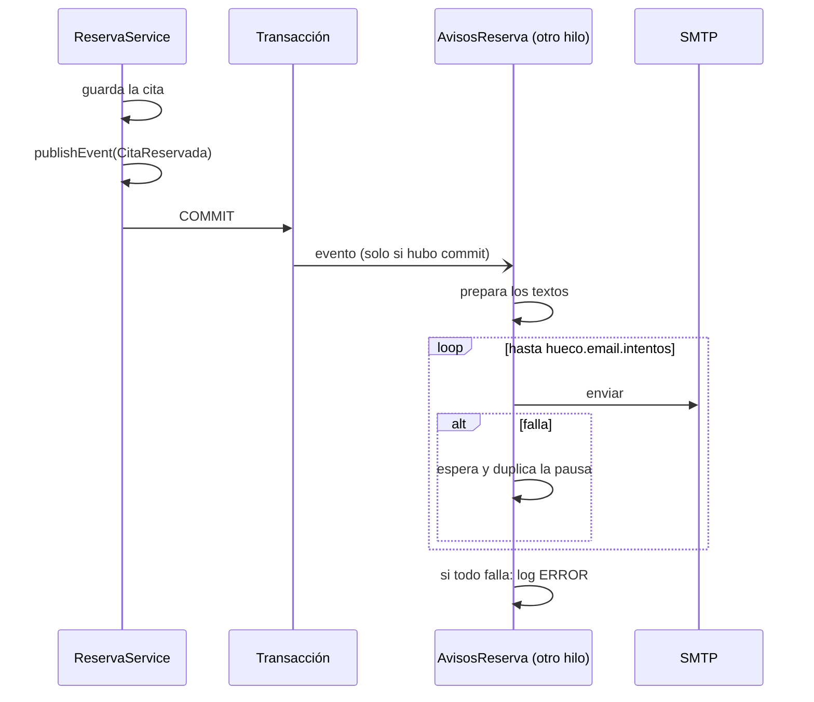

# Comercio: agenda, emails y cancelación

## Agenda

`/agenda` es la vista del comercio. Está fuera del `Layout` público (sin menú de la web) y es de **solo lectura**.

### Acceso

- Usuario: `hueco.agenda.usuario` (por defecto `comercio`).
- Clave: se configura como hash bcrypt en `hueco.agenda.clave-hash` (ver [configuración](configuracion.md#clave-de-la-agenda)).
  En desarrollo la clave es `hueco-dev`.
- El frontend pide usuario y clave y los prueba contra `GET /api/agenda`. Si son buenos, guarda la cabecera
  `Basic ...` en `sessionStorage` (`hueco.agenda`): sobrevive a recargar la página pero no a cerrar la pestaña.
- Cualquier `401` posterior borra la credencial y vuelve al formulario. **Salir** también la borra.

### Qué muestra

- Una semana (7 días) desde hoy, con **Semana anterior**, **Semana siguiente** y **Hoy**.
- Por día: si está cerrado (con el motivo del cierre, si lo hay), o sus citas ordenadas por hora.
- Por cita: inicio y fin, estado ("Confirmada", "Cancelada", "No vino"…), servicios, total, nombre del cliente
  con su teléfono (enlace para llamar) y email, y las notas.
- Las citas canceladas **siguen apareciendo**, marcadas, para que el comercio sepa que se liberó esa hora.

El comercio no puede todavía crear, mover ni cancelar citas desde la interfaz.

## Emails

Cada reserva web manda hasta dos emails:

| Email | A quién | Cuándo | Contenido |
|---|---|---|---|
| Confirmación | Al cliente | Solo si dejó email | Día, hora, servicios, duración, total, dirección, enlace a su cita y `cita.ics` adjunto. Responder va al email del negocio |
| Aviso de cita nueva | `hueco.email.aviso-comercio`, o si está vacío el email del negocio | Siempre que haya destinatario | Lo mismo más nombre, teléfono, email y notas del cliente, y enlace a la agenda. Responder va al cliente |

### Cómo se mandan

- `@TransactionalEventListener`: el evento solo se entrega **después del commit**. Si la reserva falla (hora ocupada,
  límite), no sale ningún email.
- `@Async`: se manda en otro hilo. La respuesta `201` al cliente no espera al SMTP.
- Reintentos: `hueco.email.intentos` (3) intentos, con `hueco.email.pausa-reintento` (30 s) de pausa que se duplica
  cada vez (30 s, 60 s). Si el último falla, queda un `ERROR` en el log con la cita y el destinatario.
- **La reserva nunca falla por el email.**
- Sin `spring.mail.host` o sin `hueco.email.remitente` no se manda nada y todo lo demás funciona igual.
- Los enlaces del email solo aparecen si `hueco.email.url-web` está configurada.
- El campo trampa no manda emails (no se guarda nada).

## Cancelación desde la web

El cliente cancela desde la página de su cita (`/reservar/confirmada/<token>`), a la que llega por el enlace del
email o porque la guardó.

1. El botón **Cancelar cita** solo aparece si el resumen dice `cancelable: true` (cita viva y faltan más de
   `hueco.cancelacion-horas-antes` horas, 24 por defecto).
2. Pide confirmación en un diálogo.
3. `POST /api/reservas/<token>/cancelar`. La cita pasa a `CANCELADA` y la hora queda libre al instante para otros.
4. Si ya no está a tiempo (`409 FUERA_DE_PLAZO`), se le muestra el teléfono del comercio para llamar.

El plazo se calcula con el reloj del comercio, igual que la hora de la cita.

Hoy el comercio **no recibe aviso** cuando un cliente cancela; lo ve en la agenda. Ver [limitaciones](limitaciones.md).
