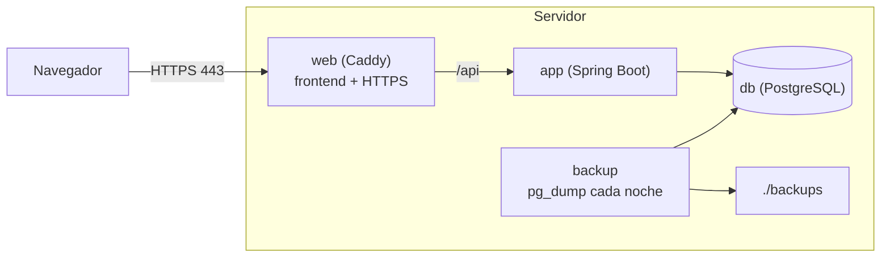

# Despliegue en un servidor propio

Todo va en un solo `docker compose`, en un servidor con Docker (un VPS pequeño basta). Las imágenes se construyen
en el propio servidor a partir del repositorio: no hace falta registro de imágenes.



| Servicio | Qué es | Ficheros |
|---|---|---|
| `db` | PostgreSQL 17. **Sin puerto publicado**: solo lo ven los demás servicios. Datos en el volumen `datos` | — |
| `app` | El backend, perfil `prod`. Aplica las migraciones al arrancar | `Dockerfile`, `application-prod.properties` |
| `web` | Caddy: sirve el frontend compilado, manda `/api` al backend y pide y renueva el certificado HTTPS | `deploy/Caddy.Dockerfile`, `deploy/Caddyfile` |
| `backup` | Copia de la base cada noche en `./backups` | `deploy/backup.sh` |

Todo está en `compose.prod.yaml`. El `compose.yaml` de la raíz es solo el Postgres de desarrollo.

## Primera instalación

Requisitos: Docker con el plugin `compose`, el dominio apuntando a la IP del servidor (registro `A`/`AAAA`) y los
puertos 80 y 443 abiertos. Caddy necesita los dos para conseguir el certificado.

1. Clonar el repositorio en el servidor.
2. Ajustar `frontend/src/business.config.js` (nombre, teléfono, logo) y las fotos de `frontend/public`.
3. Crear `.env` a partir de `.env.example` y rellenarlo:

   ```bash
   cp .env.example .env
   openssl rand -base64 32        # para POSTGRES_PASSWORD
   ```

   El hash de la clave de la agenda se genera como se explica en [configuración](configuracion.md#clave-de-la-agenda).
   Va entre **comillas simples** (`'$2a$10$...'`): sin ellas Docker Compose intenta sustituir los `$`.
4. Arrancar:

   ```bash
   docker compose -f compose.prod.yaml up -d --build
   ```

   La primera vez tarda unos minutos (descarga dependencias y compila backend y frontend). Flyway crea las tablas al
   arrancar `app`.
5. Dar de alta el comercio con [`alta-comercio.sql`](alta-comercio.sql), una vez editado:

   ```bash
   docker compose -f compose.prod.yaml exec -T db psql -U hueco -d hueco < docs/alta-comercio.sql
   ```

6. Abrir `https://<DOMINIO>`, hacer una reserva de prueba y entrar en `/agenda`.

Para no escribir `-f compose.prod.yaml` cada vez: `export COMPOSE_FILE=compose.prod.yaml` en la sesión del servidor.

## Actualizar

```bash
git pull
docker compose -f compose.prod.yaml up -d --build
```

Se reconstruyen las imágenes y se reinician `app` y `web`. Las migraciones nuevas se aplican solas al arrancar el
backend. Unos segundos sin servicio mientras arranca.

## Ver qué pasa

```bash
docker compose -f compose.prod.yaml ps
docker compose -f compose.prod.yaml logs -f app      # o web, db, backup
```

Los emails que no se pudieron mandar quedan en el log de `app`.

## IP del cliente

El backend ve las peticiones llegar desde Caddy. Caddy añade la IP real en `X-Forwarded-For`, y
`application-prod.properties` activa `server.forward-headers-strategy=native` para que el límite de reservas por IP
la use. Tomcat solo se fía de esa cabecera si la petición viene de una red interna (la red de Docker), así que desde
fuera no se puede falsear. `app` no publica puerto: solo se llega a él a través de Caddy.

## Copias de seguridad

El servicio `backup` hace un `pg_dump` cada noche a las 3:00 (hora de Madrid; `HORA_BACKUP` y `TZ` en `.env`) y lo
deja en `./backups/hueco-AAAA-MM-DD-HHMM.dump`, en formato custom. Borra las de más de **14 días**, también las
manuales: la que haya que guardar más tiempo, se saca del servidor.

Hacer una copia en el momento (por ejemplo, antes de actualizar):

```bash
docker compose -f compose.prod.yaml exec backup sh -c 'pg_dump -Fc -f /backups/hueco-manual-$(date +%Y-%m-%d-%H%M).dump'
```

### Las copias tienen que salir del servidor

`./backups` está en el mismo disco que la base de datos. Si se pierde el servidor, se pierden las dos. Hay que
copiarlas a otro sitio con regularidad, por ejemplo desde otro equipo:

```bash
rsync -av usuario@servidor:hueco/backups/ ./copias-hueco/
```

o con un `cron` en el servidor que las suba a un almacenamiento externo. Hoy es un paso manual: subirlas solas con
`rclone` está en [limitaciones](limitaciones.md).

### Restaurar

Con la aplicación parada para que nadie reserve a mitad de la restauración:

```bash
docker compose -f compose.prod.yaml stop app
docker compose -f compose.prod.yaml exec -T db pg_restore -U hueco -d hueco --clean --if-exists < backups/hueco-2026-09-28-0300.dump
docker compose -f compose.prod.yaml start app
```

`--clean --if-exists` borra lo que haya antes de cargar la copia, incluida la tabla `flyway_schema_history`, así
que Flyway ve el esquema tal como estaba el día de la copia. Si la copia es de una versión anterior, aplica las
migraciones que falten al arrancar `app`.

En un servidor nuevo: primera instalación hasta el paso 4 (sin el alta del comercio) y luego restaurar igual.

Este procedimiento se probó en local con el mismo `compose.prod.yaml`: copia con datos, borrado de clientes y
servicios, restauración y arranque de `app` con los datos de vuelta.

## Qué se guarda dónde

| Qué | Dónde | Si se pierde |
|---|---|---|
| Datos (citas, clientes, negocio) | Volumen `hueco_datos` | Restaurar la última copia |
| Copias | `./backups` | Nada, mientras haya copias fuera del servidor |
| Certificados HTTPS | Volumen `hueco_caddy-datos` | Caddy los vuelve a pedir solo |
| Configuración y secretos | `.env` | Guardarlo aparte, en un gestor de contraseñas |

`docker compose down` no borra volúmenes; `docker compose down -v` **sí borra la base de datos**.
