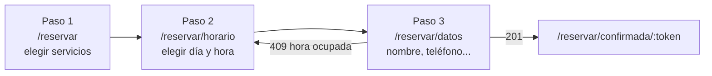
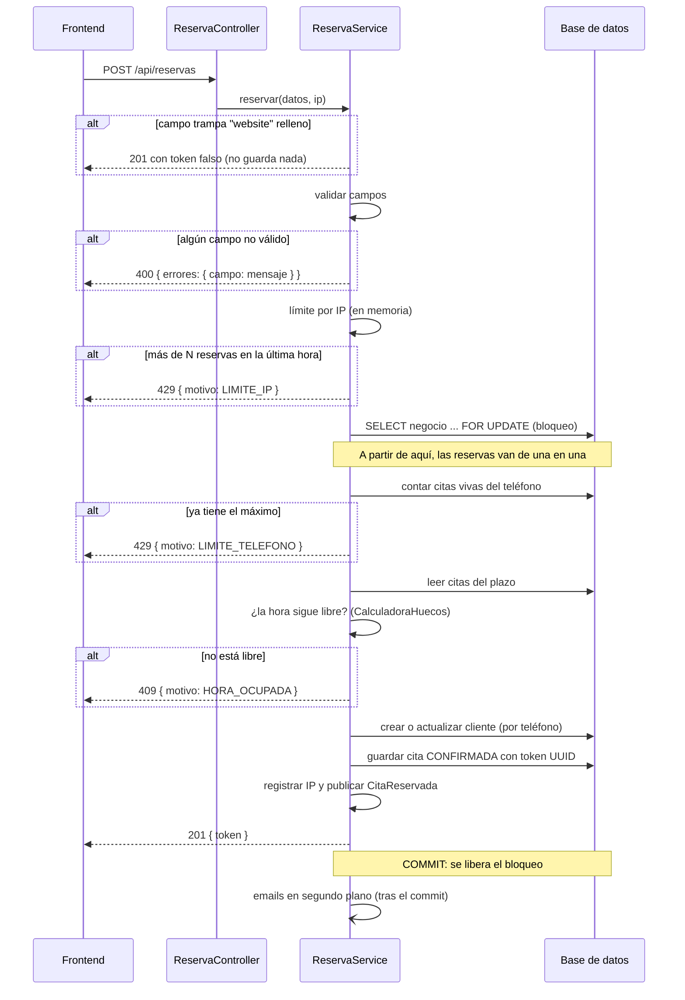

# Flujo de reserva

El cliente reserva como **invitado**: no hay registro ni contraseña. Se identifica por su teléfono.



## Paso 1: servicios (`ServiciosPage`)

1. Pide `GET /api/servicios`: solo los activos, ordenados por `orden`.
2. Los agrupa por categoría. Si hay dos o más categorías, muestra chips para saltar a cada una.
3. Cada clic añade o quita el servicio de `?servicios=` en la URL (con `replace`, para no llenar el historial).
   Los ids que no existen o no están activos se descartan sin avisar.
4. La barra inferior muestra cuántos servicios, la duración total y el precio total, y lleva al paso 2.

Se pueden elegir **varios servicios** en una cita. La duración de la cita es la suma de sus duraciones.

## Paso 2: fecha y hora (`HorarioPage`)

1. Pide `GET /api/huecos?servicios=2,5`. El backend suma las duraciones de los servicios y devuelve, para cada día
   del plazo (`hueco.dias-vista`, 30 por defecto), su estado y sus horas libres:

   ```json
   [
     { "fecha": "2026-09-28", "estado": "COMPLETO", "horas": [] },
     { "fecha": "2026-09-29", "estado": "LIBRE", "horas": ["09:00", "09:15", "16:30"] },
     { "fecha": "2026-10-04", "estado": "CERRADO", "horas": [] }
   ]
   ```

   El cálculo se explica en [Reglas y concurrencia](reglas-y-concurrencia.md#cálculo-de-horas-libres).
2. El calendario marca los días `LIBRE`. Si la URL no trae fecha, se muestra el primer día con huecos. La hora nunca
   se elige sola.
3. Si la fecha o la hora de la URL ya no están libres (enlace antiguo, recarga), se quitan de la URL sin avisar.
4. **Las horas caducan**: si el cliente deja la pestaña más de 2 minutos y vuelve, se piden de nuevo
   (`useHuecos`, `recargarAlVolverTrasMs`).
5. Con día y hora elegidos, la barra inferior lleva al paso 3.

## Paso 3: datos y confirmación (`DatosPage`)

1. Vuelve a pedir `/api/huecos`. Si la hora ya no está libre al entrar, redirige al paso 2.
2. Formulario:

   | Campo | Obligatorio | Regla |
   |---|---|---|
   | Nombre | Sí | Máximo 100 caracteres |
   | Teléfono | Sí | Español: 9 cifras que empiezan por 6, 7, 8 o 9, con o sin `+34` / `0034`. Se aceptan espacios, puntos, guiones y paréntesis |
   | Email | No | Formato `algo@algo.algo`, máximo 150 caracteres |
   | Notas | No | Máximo 300 caracteres |

   Hay además un campo oculto `website` (trampa para bots, ver abajo).
3. El frontend valida lo mismo que el backend (`lib/datosReserva.js`) para avisar antes de enviar, y lleva el foco al
   primer campo con error.
4. Lo escrito se guarda en `sessionStorage` en cada pulsación.
5. Al pulsar **Confirmar cita** el botón se deshabilita ("Confirmando…"), lo que evita el doble envío por doble clic,
   y se hace `POST /api/reservas`:

   ```json
   {
     "servicios": [2, 5],
     "fecha": "2026-10-02",
     "hora": "10:15",
     "nombre": "Ana",
     "telefono": "600 111 222",
     "email": "ana@example.com",
     "notas": "Pelo largo",
     "website": ""
   }
   ```

### Qué hace el backend (`ReservaService.reservar`)

Todo ocurre en **una sola transacción**, en este orden:



Detalles:

- **Campo trampa (honeypot)**: `website` está fuera de la pantalla y oculto a lectores de pantalla. Una persona nunca
  lo rellena; un bot sí. Si llega relleno, se responde `201` con un token inventado sin guardar nada, para no dar pistas.
- **Validación**: todos los errores se devuelven juntos, uno por campo, para pintarlos junto a cada campo.
  Fecha y hora llegan como texto para poder dar un error por campo en lugar de un 400 genérico.
- **Servicios**: se cargan de la base de datos. Los inactivos o inexistentes se ignoran; si no queda ninguno, error.
  La duración y el precio de la cita se calculan en el backend (`Cita.calcularTotales`), nunca se fían del cliente,
  y quedan congelados: si luego cambia el precio de un servicio, la cita no cambia.
- **Cliente**: el mismo teléfono normalizado es el mismo cliente. Se actualiza su nombre y, si lo da, su email.
- **Estado**: la cita nace `CONFIRMADA`. No hay nadie que confirme citas `PENDIENTE`.
- **Token**: UUID aleatorio. Es la única llave para ver o cancelar la cita, y no permite adivinar otras.
- **Emails**: se mandan después del commit y en otro hilo. Si el email falla, la reserva no falla. Ver [comercio.md](comercio.md#emails).

### Qué hace el frontend con cada respuesta

| Respuesta | Qué ve el cliente |
|---|---|
| `201 { token }` | Se borran los datos guardados y va a `/reservar/confirmada/<token>` |
| `400` con errores de nombre, teléfono, email o notas | El error junto a cada campo, con el foco en el primero |
| `400` con errores de fecha, hora o servicios | "Revisa la fecha, la hora y los servicios de tu cita." y enlace para cambiarlos |
| `409 HORA_OCUPADA` | "Esa hora se acaba de ocupar…" y botón **Elegir otra hora**. Los datos siguen guardados |
| `429 LIMITE_TELEFONO` | "Ya tienes el máximo de citas pendientes con este teléfono…" y botón para llamar |
| `429 LIMITE_IP` | "Se han hecho muchas reservas seguidas desde tu conexión…" y botón para llamar |
| Otro error o sin red | "No hemos podido confirmar la cita…" y botón para llamar |

## Confirmación (`ConfirmadaPage`)

`/reservar/confirmada/<token>` pide `GET /api/reservas/<token>`, que devuelve un resumen **sin datos personales**
(ni nombre, ni teléfono, ni email, ni notas), para que el enlace se pueda guardar o compartir sin riesgo.

Muestra:

- Fecha, hora, servicios, duración y precio.
- **Añadir a mi calendario**: descarga `GET /api/reservas/<token>/cita.ics`.
- **Cómo llegar**: enlace a Google Maps con la dirección del comercio.
- **Cancelar cita**, si todavía se puede (ver [comercio.md](comercio.md#cancelación-desde-la-web)).
- Un token que no existe muestra la página 404.
