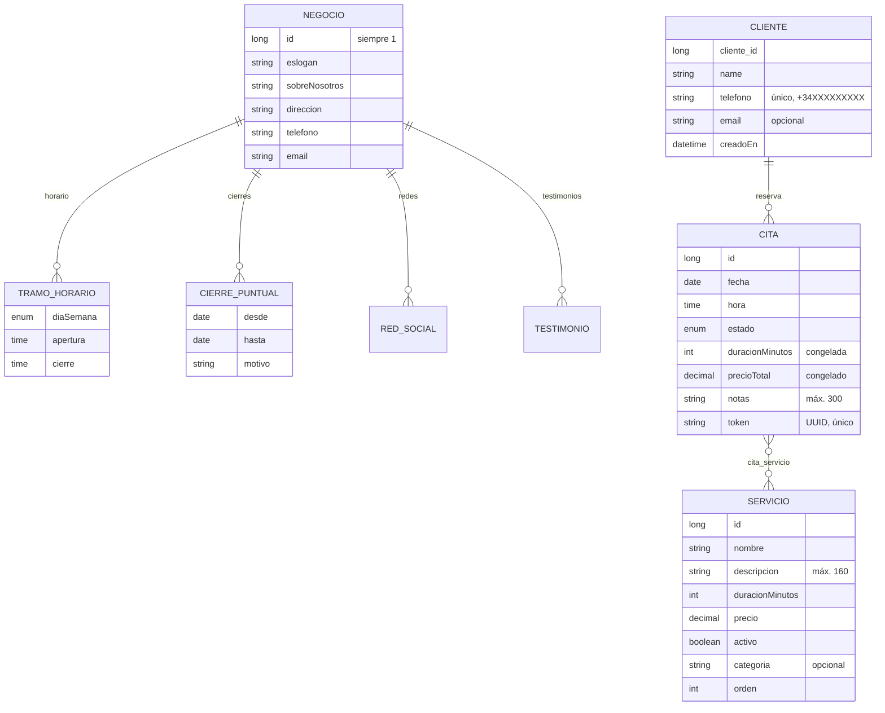
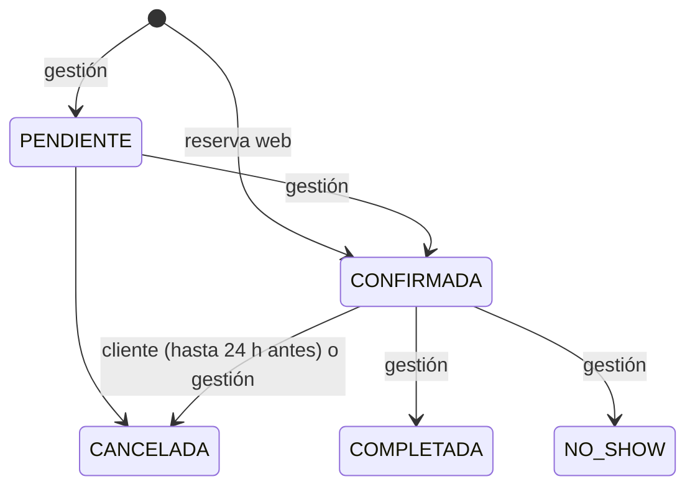

# Modelo de datos

## Negocio

Una sola fila (`id = 1`) con el contenido del comercio. Horario, cierres, redes y testimonios son colecciones
embebidas (`@ElementCollection`), en tablas `negocio_horario`, `negocio_cierre`, `negocio_red_social` y
`negocio_testimonio`.

- **Horario**: una lista de tramos. Un día sin tramos está cerrado; dos tramos el mismo día son un horario partido
  (por ejemplo 9:00–14:00 y 16:00–20:00).
- **Cierres puntuales**: días completos, con `desde` y `hasta` incluidos (vacaciones, festivos).
- **El nombre del comercio no está aquí**: se fija al compilar el frontend en `business.config.js`, junto al logo y
  las fotos.

La fila del negocio también sirve de **cerrojo** para las reservas (ver [concurrencia](reglas-y-concurrencia.md#dos-reservas-a-la-misma-hora)).

## Servicio

Lo que se puede reservar. Solo los `activo` salen en la web y se aceptan en una reserva. `orden` fija el orden de la
carta; `categoria` agrupa (Pelo, Barba…).

## Cliente

Se crea o se actualiza al reservar. **El teléfono normalizado es la identidad**: si alguien reserva con un teléfono
que ya existe, es el mismo cliente y se actualiza su nombre (y su email, si lo da). No hay contraseña ni cuenta.

Datos personales que se guardan: nombre, teléfono, email (opcional) y, en cada cita, las notas (opcionales).
Nunca salen por los endpoints públicos: solo por la agenda y la gestión, que piden credencial.

## Cita

| Campo | Notas |
|---|---|
| `fecha`, `hora` | Hora de inicio, en la zona del comercio |
| `servicios` | Uno o varios, tabla `cita_servicio` |
| `duracionMinutos`, `precioTotal` | Suma de los servicios, calculada **una vez** al guardar (`@PrePersist`). Si después cambia el precio o la duración de un servicio, la cita conserva lo acordado |
| `estado` | Ver abajo |
| `cliente` | Puede ser `null` en citas creadas desde la gestión |
| `notas` | Lo que escribió el cliente |
| `token` | UUID aleatorio generado al guardar. Es la llave pública de la cita: página de confirmación, `.ics` y cancelación |

### Estados de una cita

| Estado | ¿Ocupa hueco? | ¿Cuenta para el límite por teléfono? | ¿Se puede cancelar desde la web? |
|---|---|---|---|
| `PENDIENTE` | Sí | Sí | Sí, dentro del plazo |
| `CONFIRMADA` | Sí | Sí | Sí, dentro del plazo |
| `CANCELADA` | No | No | Ya lo está (responde `200`) |
| `COMPLETADA` | No | No | No (`409 NO_CANCELABLE`) |
| `NO_SHOW` | No | No | No (`409 NO_CANCELABLE`) |

`PENDIENTE` ocupa hueco a propósito: si no lo hiciera, dos personas podrían coger la misma hora mientras una espera
confirmación. Hoy las reservas web nacen `CONFIRMADA` porque no hay pantalla para confirmar; los cambios de estado
de la gestión se hacen con `PATCH /api/citas/{id}`.

## Esquema

PostgreSQL. Las tablas las crean y cambian las migraciones de Flyway (`src/main/resources/db/migration`); Hibernate
solo valida al arrancar que las entidades cuadran con ellas. Ver [migraciones](migraciones.md).

- Los ids de `servicio`, `cita` y `cliente` son columnas `GENERATED BY DEFAULT AS IDENTITY`: se pueden insertar
  filas a mano sin tocar secuencias.
- `negocio.sobre_nosotros` es `text`, sin límite de longitud.
- En el perfil `dev`, `db/dev/R__datos_dev.sql` carga una peluquería de ejemplo si la base está vacía.
