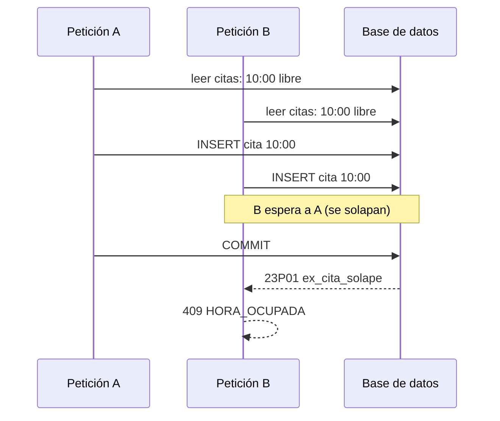

# Reglas de reserva y concurrencia

Este documento responde a tres preguntas:

1. ¿Qué horas se ofrecen al cliente? ([Cálculo de horas libres](#cálculo-de-horas-libres))
2. ¿Cómo se evita que dos citas cojan la misma hora? ([Dos reservas a la misma hora](#dos-reservas-a-la-misma-hora))
3. ¿Cómo se evita que un mismo cliente acapare citas o reserve dos a la vez? ([Un mismo cliente](#un-mismo-cliente))

## Parámetros

Todos están en `application.properties` y se pueden cambiar sin tocar código (ver [configuración](configuracion.md)).

| Propiedad | Por defecto | Qué controla |
|---|---|---|
| `hueco.paso-minutos` | `15` | Rejilla de horas de inicio: 9:00, 9:15, 9:30… |
| `hueco.margen-minutos` | `5` | Tiempo libre tras cada cita (limpiar, cobrar) |
| `hueco.dias-vista` | `30` | Cuántos días, contando hoy, se pueden reservar |
| `hueco.antelacion-minutos` | `120` | No se ofrecen horas que empiecen antes de ahora + este margen |
| `hueco.max-citas-por-telefono` | `3` | Citas futuras vivas que puede tener un mismo teléfono |
| `hueco.max-reservas-por-ip-hora` | `10` | Reservas por IP en la última hora |
| `hueco.cancelacion-horas-antes` | `24` | Hasta cuántas horas antes se puede cancelar desde la web |

## Cálculo de horas libres

Lo hace `CalculadoraHuecos`, una clase **sin acceso a base de datos**: recibe el horario, los cierres y las citas
existentes y devuelve el resultado. `HuecoService` le pasa los datos y `ReservaService` la vuelve a usar al reservar,
así que **las horas que se ofrecen y las que se aceptan salen del mismo cálculo**.

### Algoritmo

Para cada día desde hoy hasta `dias-vista` días:

1. **¿Está abierto?** Si ese día de la semana no tiene tramos de horario, o cae dentro de un `CierrePuntual`
   (vacaciones, festivo), el día es `CERRADO` y no tiene horas.
2. **Citas que ocupan.** Se toman las citas de ese día en estado `PENDIENTE` o `CONFIRMADA`
   (`EstadoCita.bloqueaHueco()`). Las `CANCELADA`, `COMPLETADA` y `NO_SHOW` no ocupan.
   Cada una ocupa el intervalo `[hora, hora + duración + margen)`.
3. **Horas candidatas.** Por cada tramo (por ejemplo 9:00–14:00 y 16:00–20:00), se prueban horas de inicio cada
   `paso-minutos` desde la apertura. Una hora es candidata si:
   - la cita **más el margen** termina como tarde al cierre del tramo (una cita no puede cruzar la pausa del mediodía);
   - empieza como pronto en `ahora + antelacion-minutos`.
4. **¿Cabe?** La cita nueva ocuparía `[inicio, inicio + duración + margen)`. Se atiende una cita a la vez, así que
   cabe si ese intervalo no se cruza con el de ninguna cita que ocupa.
5. **Estado del día.** Con alguna hora libre es `LIBRE`; si no queda ninguna es `COMPLETO`.

La duración es la **suma** de los servicios elegidos. Un corte de 30 minutos y una barba de 20 buscan un hueco de 50.

### Ejemplo

Martes con tramo 9:00–14:00, `paso=15`, `margen=5`. Ya hay una cita a las 10:00 de 30 minutos, que
ocupa `[10:00, 10:35)`. Un cliente busca hueco para un servicio de 30 minutos, que necesita 35 contando el margen:

| Inicio | Ocuparía | ¿Libre? | Por qué |
|---|---|---|---|
| 9:15 | 9:15–9:50 | Sí | No toca la cita de las 10:00 |
| 9:30 | 9:30–10:05 | **No** | La cita de las 10:00 empieza dentro |
| 9:45 | 9:45–10:20 | **No** | Igual |
| 10:00 | 10:00–10:35 | **No** | Ya hay una cita a esa hora |
| 10:30 | 10:30–11:05 | **No** | La cita de las 10:00 sigue ocupando hasta las 10:35 por el margen |
| 10:45 | 10:45–11:20 | Sí | |
| 13:15 | 13:15–13:50 | Sí | Última: termina antes de las 14:00 |
| 13:30 | 13:30–14:05 | **No** | Se pasa del cierre del tramo |

Una cita a las 10:15 bloquearía igual las 10:00 aunque no empiecen a la misma hora: lo que cuenta es si los
intervalos se cruzan.

### Tiempo y zona horaria

"Hoy" y "ahora" se calculan con el `Clock` del comercio (`hueco.zona-horaria`, por defecto `Europe/Madrid`),
no con el reloj del servidor ni del navegador. Un servidor en UTC o un cliente de viaje ven las mismas horas.

## Dos reservas a la misma hora

### El problema

Entre que el cliente ve una hora libre y pulsa **Confirmar** pueden pasar minutos. En ese tiempo otra persona puede
reservar esa misma hora. Y dos peticiones pueden llegar a la vez, con milisegundos de diferencia:

```
Petición A: ¿10:00 libre? → sí ─────────────→ guarda cita 10:00
Petición B:     ¿10:00 libre? → sí ─────────────→ guarda cita 10:00   ← dos citas a la misma hora
```

Comprobar y luego guardar no basta si las dos peticiones comprueban antes de que ninguna haya guardado.

### La solución: la base de datos rechaza el solape

La migración `V7__margen_en_solape.sql` deja en la tabla `cita` una restricción de exclusión:

```sql
ALTER TABLE cita
    ADD CONSTRAINT ex_cita_solape EXCLUDE USING gist (
        tsrange(fecha + hora, fecha + hora + make_interval(mins => duracion_minutos + margen_minutos)) WITH &&
    ) WHERE (estado IN ('PENDIENTE', 'CONFIRMADA'));
```

Cada cita viva ocupa `[inicio, fin + margen)`, el mismo intervalo que usa `CalculadoraHuecos`, y PostgreSQL no deja
guardar dos que se crucen, vengan de donde vengan: la reserva pública, la gestión o un `INSERT` a mano.
`margen_minutos` es el margen con el que se reservó cada cita (`hueco.margen-minutos` en ese momento).

Si dos inserciones que chocan van a la vez, la segunda **espera** a que la primera termine: si la primera confirma,
la segunda falla con SQLState `23P01`; si la primera se deshace, la segunda entra. Es la misma garantía que un
bloqueo, pero solo entre citas que se pisan: las reservas a horas distintas no se esperan.



`ReservaService.reservar` sigue comprobando antes con `calculadora.libre(...)`, el mismo cálculo que ofrece las
horas. Es lo que resuelve el caso normal, en el que la otra cita ya estaba guardada, y lo que cubre los demás motivos
por los que una hora deja de valer: se ha pasado el plazo de antelación, el comercio ha añadido un cierre, o alguien
manda a mano una hora fuera de la rejilla o del horario. La restricción cubre la carrera: la cita se guarda con
`saveAndFlush` y, si choca, el servicio convierte el error en `ReservaRechazadaException(HORA_OCUPADA)`.

En los dos casos el cliente recibe `409`, y el frontend le dice "Esa hora se acaba de ocupar" y le deja elegir otra
sin perder lo que ha escrito. Como la transacción se deshace entera, tampoco queda guardado el cliente, no cuenta
para el límite por IP y no sale ningún email. En los endpoints de gestión, `ErroresBaseDeDatos` hace la misma
conversión: `409 { "motivo": "HORA_OCUPADA" }`.

### El único bloqueo: por teléfono

La restricción no puede comprobar el límite de citas por teléfono ni el alta del cliente (ver
[Un mismo cliente](#un-mismo-cliente)): los dos son "contar o buscar, y luego escribir". Para eso, antes de esa
parte, `BloqueoTelefono` toma un bloqueo consultivo de PostgreSQL con la clave del teléfono:

```sql
SELECT pg_advisory_xact_lock(1, hashtext('+34600111222'));
```

Se suelta solo al terminar la transacción. Dos reservas del **mismo** teléfono van una detrás de otra; las de
teléfonos distintos van en paralelo. El `1` separa estos bloqueos de otros que la aplicación pueda usar en el futuro.
Si dos teléfonos distintos dieran el mismo `hashtext`, lo único que pasaría es que se esperarían entre sí.

### Por qué así

- **Antes se bloqueaba el negocio.** Hasta V7 cada reserva hacía `SELECT … FOR UPDATE` sobre la fila del negocio
  (`id = 1`), así que todas las reservas iban en fila india, aunque fueran de días distintos. Funcionaba, pero
  convertía esa fila en un cuello de botella.
- **Por qué no un índice único sobre `(fecha, hora)`.** Dos citas pueden chocar sin empezar a la misma hora (una a las
  10:00 de 30 minutos y otra a las 10:15). La restricción de exclusión compara intervalos, que es lo que hace falta.
- **Por qué no bloqueo optimista.** El optimista detecta que *una fila* ha cambiado, y aquí el conflicto es con una
  fila que todavía no existe.
- **Lo que no bloquea.** Validar campos, el campo trampa y el límite por IP van antes del bloqueo por teléfono.
  Consultar horas (`GET /api/huecos`) no bloquea nada.

### Qué no cubre

Las citas que crea el comercio por los endpoints de gestión (`POST /api/citas/create`, `PATCH /api/citas/{id}`)
**no** miran horario, cierres ni límites, y se guardan con `margen_minutos = 0`. La base de datos les impide el solape
estricto, pero no les exige margen: dos citas seguidas (9:00–9:30 y 9:30–10:00) creadas así caben. Ver
[limitaciones](limitaciones.md).

### Prueba

- `ReservasEndpointTest.dosReservasSimultaneasALaMismaHora` lanza dos reservas a la vez en dos hilos, liberados a la
  vez con un `CountDownLatch`, para la misma hora y con teléfonos distintos. Comprueba que exactamente una recibe
  `HORA_OCUPADA` y que en la base de datos hay una sola cita. `unaHoraYaOcupadaDa409` cubre el caso secuencial.
- `ConcurrenciaReservasTest.siOtraReservaCogeElMargenMientrasTantoDa409` fuerza la carrera. Otra transacción tiene
  insertada, sin confirmar, una cita a las 10:30, que la comprobación en Java no ve. La reserva de las 10:00 choca
  con ella por el margen en cuanto la otra confirma, y recibe `HORA_OCUPADA`.
- `ConcurrenciaReservasTest.reservarNoEsperaPorElNegocio` y `soloEsperanLasReservasDelMismoTelefono` comprueban que
  ya no hay fila india: con el negocio bloqueado se reserva igual, y con el teléfono de un cliente bloqueado solo
  espera ese cliente.

## Un mismo cliente

### Cómo se identifica al cliente

No hay cuentas. El cliente es su **teléfono normalizado** (`Telefonos.normalizar`): se quitan espacios, puntos,
guiones y paréntesis, se quita el prefijo `+34` o `0034` si viene, se exige que queden 9 cifras que empiezan por
6, 7, 8 o 9, y se guarda como `+34XXXXXXXXX`. Así, `600 111 222`, `600-111-222` y `+34 600111222` son el mismo cliente.
En la tabla `cliente`, `telefono` es único. La búsqueda y el alta van dentro del bloqueo por teléfono, así que dos
reservas simultáneas de un teléfono nuevo crean un solo cliente.

### Límite de citas por teléfono

Dentro del bloqueo por teléfono, antes de comprobar la hora:

```java
long vivas = citaRepository.countByClienteTelefonoAndFechaGreaterThanEqualAndEstadoIn(
        telefono, hoy, List.of(PENDIENTE, CONFIRMADA));
if (vivas >= reglas.maxCitasPorTelefono()) throw new ReservaRechazadaException(LIMITE_TELEFONO);
```

Un teléfono puede tener como mucho `max-citas-por-telefono` (3) citas **vivas** de hoy en adelante. Las canceladas o
pasadas no cuentan: al cancelar una, se libera el cupo. La cuarta recibe `429 LIMITE_TELEFONO` y el frontend le
propone llamar al comercio.

Como la cuenta se hace **dentro del bloqueo por teléfono**, dos peticiones simultáneas del mismo teléfono no pueden
colarse a la vez por debajo del límite.

Pruebas: `ReservasEndpointTest.laCuartaCitaDelMismoTelefonoDa429`,
`ConcurrenciaReservasTest.elMismoTelefonoEnElLimiteSoloConsigueUnaMas` y
`unTelefonoNuevoReservandoDosVecesALaVezEsUnSoloCliente`.

### Dos citas del mismo cliente al mismo tiempo

- **Es imposible**: el comercio tiene una sola agenda y atiende una cita a la vez, así que `ex_cita_solape` no deja
  coincidir dos citas de nadie, tampoco dos de la misma persona. No hace falta una comprobación aparte por teléfono.
  Si algún día hubiera varias agendas o profesionales, sí: la restricción pasaría a ser por agenda y habría que
  comprobar el solape del teléfono dentro del bloqueo por teléfono.
- **Doble clic**: el botón **Confirmar cita** se deshabilita mientras se envía, así que no salen dos peticiones.
  Aun así, si llegaran dos, el bloqueo por teléfono las pondría en fila y la segunda vería la hora ocupada.

## Protección contra abusos

| Medida | Dónde | Qué hace | Respuesta |
|---|---|---|---|
| Campo trampa `website` | `ReservaService`, lo primero | Un bot que rellena todos los campos lo rellena. Se responde como si hubiera ido bien y no se guarda nada | `201` con token falso |
| Límite por IP | `LimiteReservasPorIp`, antes del bloqueo por teléfono | Como mucho `max-reservas-por-ip-hora` (10) reservas **hechas** por IP en la última hora (ventana deslizante). Solo cuentan las que acaban guardadas | `429 LIMITE_IP` |
| Límite por teléfono | `ReservaService`, dentro del bloqueo por teléfono | Ver arriba | `429 LIMITE_TELEFONO` |
| Validación en servidor | `ReservaService` | Nunca se fía del frontend: longitudes, formato de teléfono y email, servicios activos, fecha y hora válidas | `400` con errores por campo |
| Precio y duración en servidor | `Cita` (`@PrePersist`) | Se calculan de los servicios en la base de datos, no de lo que mande el cliente | — |

El límite por IP vive **en memoria** (se pierde al reiniciar y no se comparte entre varias instancias) y usa la IP
de la conexión, sin mirar `X-Forwarded-For`. Detrás de un proxy inverso todos los clientes compartirían IP. Ver
[limitaciones](limitaciones.md).

## Cancelación

`POST /api/reservas/{token}/cancelar`:

| Situación | Resultado |
|---|---|
| Cita viva y faltan más de `cancelacion-horas-antes` (24 h) | Pasa a `CANCELADA`; la hora vuelve a estar libre al momento |
| Cita viva y faltan 24 h o menos | `409 FUERA_DE_PLAZO`: hay que llamar al comercio |
| Cita `COMPLETADA` o `NO_SHOW` | `409 NO_CANCELABLE` |
| Cita ya `CANCELADA` | `200` sin cambios (pulsar dos veces no es un error) |
| Token que no existe | `404` |

El resumen de la cita lleva un campo `cancelable` para que el frontend solo enseñe el botón cuando tiene sentido.

## Resumen de pruebas

| Regla | Prueba |
|---|---|
| Servicio que no cabe antes de la pausa | `CalculadoraHuecosTest.elServicioNoCabeAntesDeLaPausaDelMediodia` |
| Margen tras cada cita | `CalculadoraHuecosTest.dejaElMargenDespuesDeCadaCita` |
| Una cita a la vez | `unaCitaOcupaLaHora`, `unaCitaQueEmpiezaDespuesTambienBloqueaLasHorasQueLaPisarian` |
| Antelación mínima | `respetaLaAntelacionMinimaHoy`, `hoyCuandoLaAntelacionNoDejaNingunaHoraEstaCompleto` |
| Cierres puntuales | `unDiaDeCierrePuntualEstaCerrado` |
| Canceladas no ocupan | `lasCitasCanceladasNoBloquean`, `ReservasEndpointTest.cancelarDejaLibreLaHora` |
| Hora ocupada | `ReservasEndpointTest.unaHoraYaOcupadaDa409` |
| Reservas simultáneas | `ReservasEndpointTest.dosReservasSimultaneasALaMismaHora`, `ConcurrenciaReservasTest.siOtraReservaCogeElMargenMientrasTantoDa409` |
| Sin fila india | `ConcurrenciaReservasTest.reservarNoEsperaPorElNegocio`, `soloEsperanLasReservasDelMismoTelefono` |
| Sin solapes en la base de datos | `RestriccionesBaseDeDatosTest.laGestionNoPuedeCrearDosCitasSolapadas`, `moverUnaCitaEncimaDeOtraResponde409`, `seguidasSinMargenSiCaben`, `unaCitaCanceladaNoOcupa`, `ConcurrenciaReservasTest.laBaseDeDatosRechazaUnaCitaDentroDelMargenDeOtra` |
| Límite por teléfono | `ReservasEndpointTest.laCuartaCitaDelMismoTelefonoDa429`, `ConcurrenciaReservasTest.elMismoTelefonoEnElLimiteSoloConsigueUnaMas` |
| Mismo teléfono, mismo cliente | `ReservasEndpointTest.elMismoTelefonoEsElMismoCliente`, `ConcurrenciaReservasTest.unTelefonoNuevoReservandoDosVecesALaVezEsUnSoloCliente` |
| Límite por IP | `LimiteReservasPorIpTest.permiteHastaElMaximoPorHoraYLuegoSeLibera` |
| Campo trampa | `ReservasEndpointTest.elCampoTrampaRespondeBienSinGuardar` |
| Plazo de cancelación | `conMenosHorasDeLasPermitidasHayQueLlamar`, `unaCitaCompletadaNoSeCancela` |
